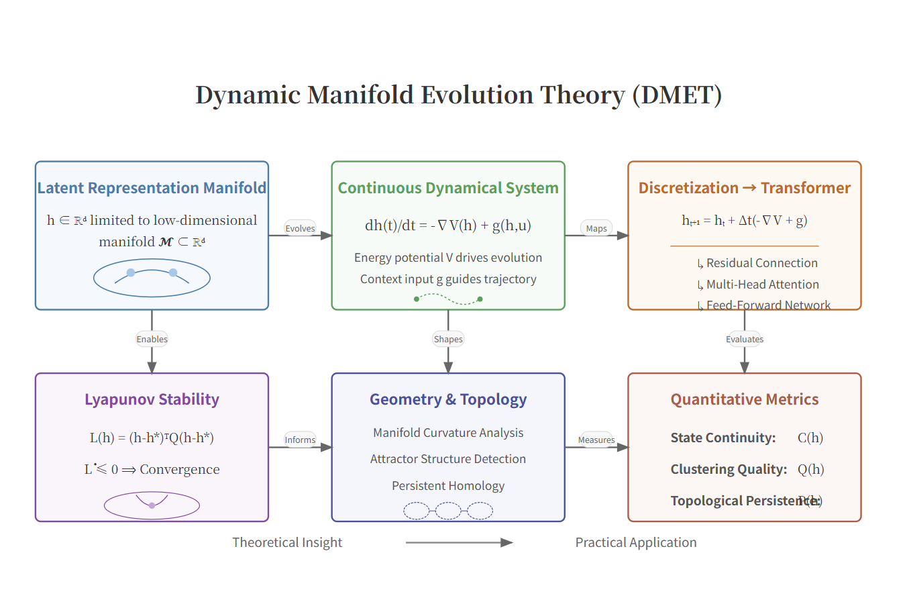
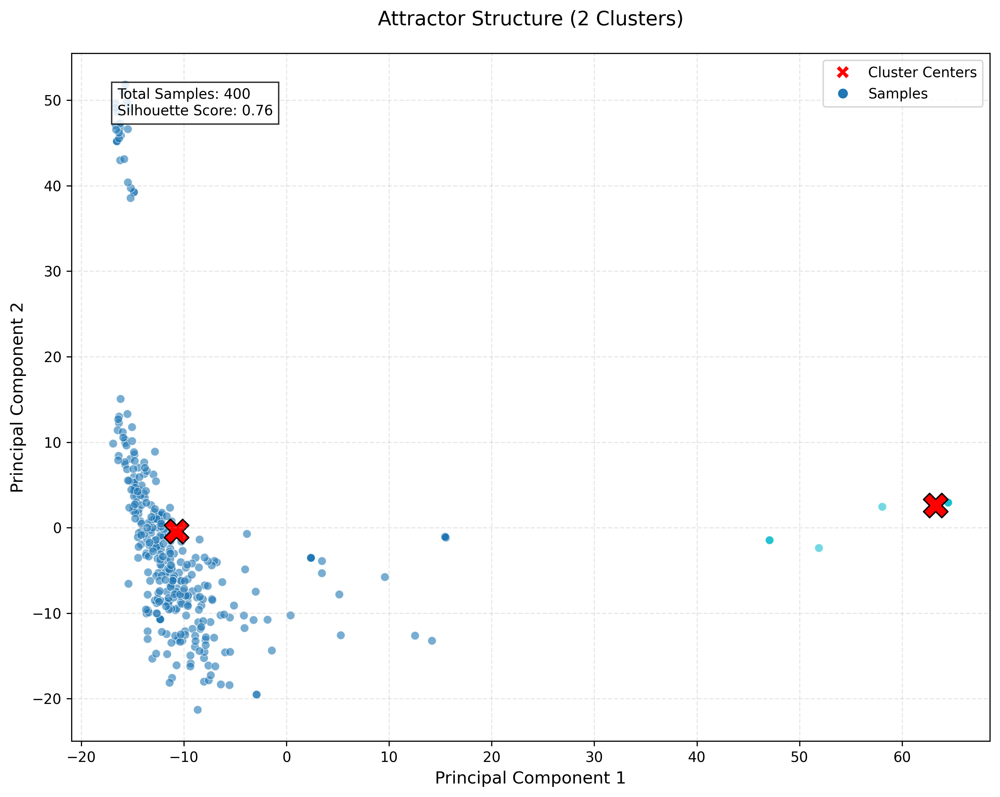
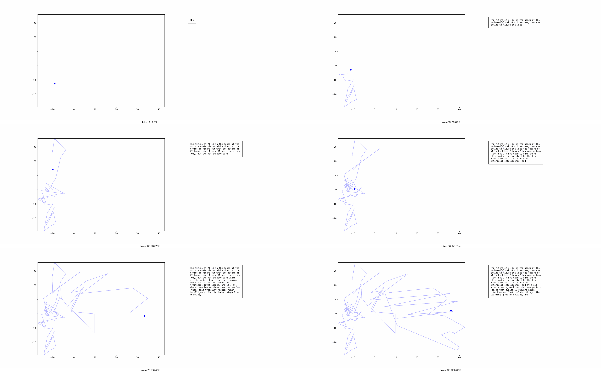
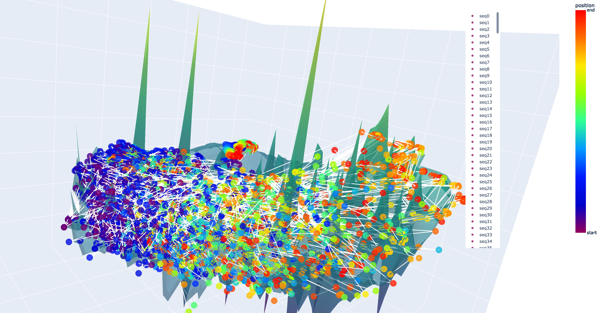

# Dynamic Manifold Evolution Theory (DMET)[arXiv](https://arxiv.org/abs/2505.20340) 



**Dynamic Manifold Evolution Theory (DMET)** is a groundbreaking mathematical framework that reinterprets large language model (LLM) generation as a controlled dynamical system evolving on a low-dimensional semantic manifold. This repository contains the official implementation of our paper, providing tools to analyze and optimize latent representations in LLMs through the lens of dynamical systems theory.

## 🧠 Core Idea

Traditional views treat LLM generation as sequential token prediction. DMET revolutionizes this perspective by modeling generation as **continuous trajectory evolution** on a semantic manifold, where latent states evolve under combined influence of:

1. **Intrinsic energy-driven flows** (-∇V)
2. **Context-dependent forces** (g)

This novel approach bridges discrete token generation with continuous-time dynamical modeling, enabling:
- Lyapunov stability guarantees for semantic coherence
- Geometric regularization of latent manifolds
- Quantitative links between trajectory properties and text quality

## 🚀 Key Contributions

1. **Unified theoretical framework** mapping Transformer components to dynamical systems
2. **Stability guarantees** via Lyapunov theory to prevent hallucinations
3. **Geometric regularizers** (curvature penalty, topological constraints)
4. **Empirical metrics** quantifying:
   - State continuity → Text fluency
   - Clustering quality → Grammaticality
   - Topological persistence → Semantic coherence
5. **Practical guidelines** for parameter tuning balancing creativity and consistency

## 📊 Key Findings

### 1. Attractor Structures in Latent Space

*Robust attractor structures (silhouette score=0.76) confirm theoretical predictions of semantic convergence*

### 2. Three-Phase Trajectory Evolution

*Characteristic trajectory pattern: Exploration → Expansion → Convergence*

### 3. Collective Dynamics on Semantic Manifold

*400 samples showing fan-shaped dispersion and coherent manifold structure*

## 📂 Repository Structure

```text
project_root/
│
├── config/
│   └── experiment_config.py  # Experiment configuration
├── data_processing/
│   ├── data_preprocessor.py  # Data preprocessing
│   └── hidden_state_collector.py  # Hidden state collection
├── analysis/
│   ├── dynamical_analyzer.py  # Dynamical analysis
│   ├── correlation_analyzer.py  # Correlation analysis
│   ├── statistical_validator.py  # Statistical validation
│   └── text_evaluator.py  # Text evaluation
├── visualization/
│   ├── trajectory_visualizer.py  # Trajectory visualization
│   ├── analysis_visualizer.py  # Analysis visualization
│   └── gif_processor.py  # GIF processing
├── models/
│   └── model_loader.py  # Model loading
├── main.py  # Main entry point
```

## 🚀 Quick Start

### 1. Install Dependencies
```bash
pip install -r requirements.txt
```

### 2. Configure Experiments
Modify parameters in `config/experiment_config.py`:
```python
class ExperimentConfig:
    def __init__(self):
        self.model_name = "deepseek-ai/deepseek-llm-r1"  # Base model
        self.temperatures = [0.1, 0.5, 1.0, 1.5, 2.0]  # Temperature values
        self.top_ps = [0.3, 0.6, 0.8, 1.0]  # Top-p sampling values
        self.num_samples = 10  # Samples per configuration
        self.max_length = 100  # Max tokens per sample
        self.prompt = "The future of AI is"  # Generation prompt
```

### 3. Run Multi-Experiment Analysis
```bash
python main.py
```

The pipeline executes:
1. 📝 Text generation across parameter configurations
2. 🧠 Hidden state collection at each generation step
3. 🔍 Dynamical analysis (continuity, clustering, topology)
4. 📊 Text quality evaluation
5. 📈 Correlation analysis
6. 🖼️ Visualization generation

## 📊 Expected Outputs

After execution, you'll find:
- `results/dynamics_metrics.csv`: State continuity, clustering quality, topological persistence
- `results/text_quality_scores.csv`: Fluency, grammaticality, coherence scores
- `results/correlation_analysis.json`: Statistical correlations
- `figures/`: Visualizations including trajectory plots and analysis charts

## 📜 Citation

```bibtex
@misc{zhang2025dynamicmanifoldevolutiontheory,
      title={Dynamic Manifold Evolution Theory: Modeling and Stability Analysis of Latent Representations in Large Language Models}, 
      author={Yukun Zhang and Qi Dong},
      year={2025},
      eprint={2505.20340},
      archivePrefix={arXiv},
      primaryClass={cs.CL},
      url={https://arxiv.org/abs/2505.20340}, 
}
```

## 🤝 Contributing
We welcome contributions! Please open an issue or submit a PR.

## 📧 Contact
For questions, please contact:
- Yukun Zhang: 215010026@link.cuhk.edu.cn
- Qi Dong: 19210980065@fudan.edu.cn